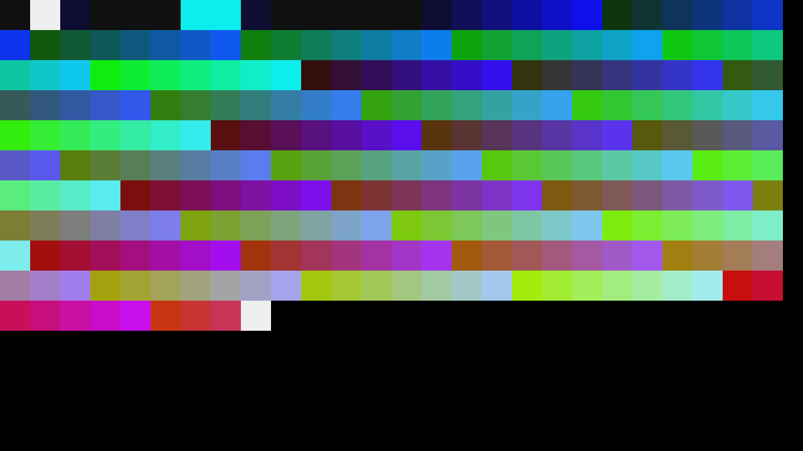
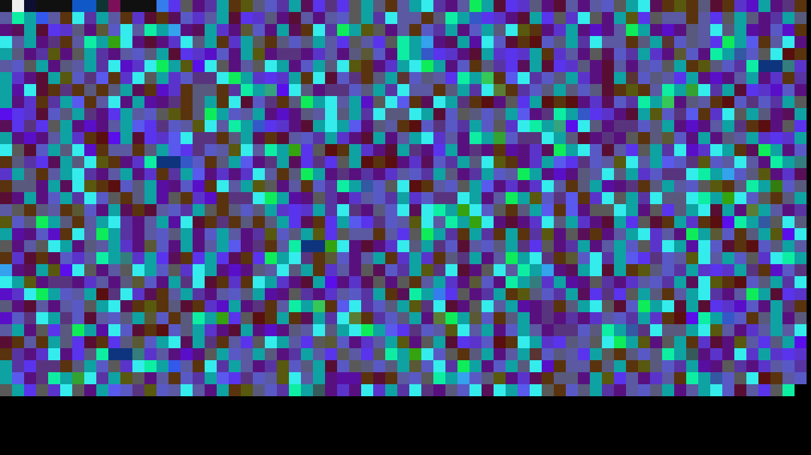

This repo contains some experiments that involve encoding arbitrary data into video files that survive Youtube compression.

Live demo you can try yourself: https://iancaling.com/steg/

The current solution works 99% of the time and only rarely encounters errors in practice.
It works 100% of the time under ideal conditions (i.e. when not round-tripped through Youtube).

When encoding some data, each byte is converted to a "tile", which is a rectangle of arbitrary size filled with one of 256 colors.
The "palette" used for these colors was specifically tuned to maximize resistance to Youtube's compression.

One "frame" of video is made up of as many tiles as will fit. In a 720p (1280x720) video, for example,
we can fit 3600 16x16 tiles, or 3.6kB of data.

Naturally, this results in video files that take up much more space than the unencoded data.
In practice, I generally see a compression ratio of around 1:5-6, meaning the video files are about 5-6x larger than the
unencoded data.

Here is an encoded frame containing the byte values 0 through 255, following a 13-byte header:



This was generated using the command `uv run rainbow`. 
It can be decoded using the command `uv run decode_frame docs/palette_20250824.png -o output.bin`:

```bash
$ hexdump -C output.bin 
00000000  00 01 02 03 04 05 06 07  08 09 0a 0b 0c 0d 0e 0f  |................|
00000010  10 11 12 13 14 15 16 17  18 19 1a 1b 1c 1d 1e 1f  |................|
00000020  20 21 22 23 24 25 26 27  28 29 2a 2b 2c 2d 2e 2f  | !"#$%&'()*+,-./|
00000030  30 31 32 33 34 35 36 37  38 39 3a 3b 3c 3d 3e 3f  |0123456789:;<=>?|
00000040  40 41 42 43 44 45 46 47  48 49 4a 4b 4c 4d 4e 4f  |@ABCDEFGHIJKLMNO|
00000050  50 51 52 53 54 55 56 57  58 59 5a 5b 5c 5d 5e 5f  |PQRSTUVWXYZ[\]^_|
00000060  60 61 62 63 64 65 66 67  68 69 6a 6b 6c 6d 6e 6f  |`abcdefghijklmno|
00000070  70 71 72 73 74 75 76 77  78 79 7a 7b 7c 7d 7e 7f  |pqrstuvwxyz{|}~.|
00000080  80 81 82 83 84 85 86 87  88 89 8a 8b 8c 8d 8e 8f  |................|
00000090  90 91 92 93 94 95 96 97  98 99 9a 9b 9c 9d 9e 9f  |................|
000000a0  a0 a1 a2 a3 a4 a5 a6 a7  a8 a9 aa ab ac ad ae af  |................|
000000b0  b0 b1 b2 b3 b4 b5 b6 b7  b8 b9 ba bb bc bd be bf  |................|
000000c0  c0 c1 c2 c3 c4 c5 c6 c7  c8 c9 ca cb cc cd ce cf  |................|
000000d0  d0 d1 d2 d3 d4 d5 d6 d7  d8 d9 da db dc dd de df  |................|
000000e0  e0 e1 e2 e3 e4 e5 e6 e7  e8 e9 ea eb ec ed ee ef  |................|
000000f0  f0 f1 f2 f3 f4 f5 f6 f7  f8 f9 fa fb fc fd fe ff  |................|
```

We can encode a file into one or more frames using `uv run encode_file` (use `-h` to see additional flags).
Here's lorem ipsum:



```bash
$ uv run encode_file tests/test_data/loremipsum.txt ./
$ uv run decode_frame docs/lorem_ipsum_20250824.png -r | hexdump -C
00000000  4c 6f 72 65 6d 20 69 70  73 75 6d 20 64 6f 6c 6f  |Lorem ipsum dolo|
00000010  72 20 73 69 74 20 61 6d  65 74 2c 20 63 6f 6e 73  |r sit amet, cons|
00000020  65 63 74 65 74 75 72 20  61 64 69 70 69 73 63 69  |ectetur adipisci|
00000030  6e 67 20 65 6c 69 74 2e  20 45 74 69 61 6d 20 74  |ng elit. Etiam t|
00000040  69 6e 63 69 64 75 6e 74  20 63 6f 6e 73 65 63 74  |incidunt consect|
00000050  65 74 75 72 20 6d 61 74  74 69 73 2e 20 44 6f 6e  |etur mattis. Don|
00000060  65 63 20 6f 72 6e 61 72  65 20 70 6f 72 74 74 69  |ec ornare portti|
[...]
```

Video files containing one or more frames can be decoded in their entirety using the `uv run decode_video` command.

The means of uploading to and downloading from Youtube is left up to the reader.
I upload tests manually and use [yt-dlp](https://github.com/yt-dlp/yt-dlp) to download.
My tests are viewable publicly on [my Youtube channel](https://www.youtube.com/@ianling8575/videos).

## WebGPU Compute Shader Decoding
The [webgpu](webgpu) directory contains an [index.html](webgpu/index.html) file you can open in your browser
to decode videos locally. This page uses a WebGPU compute shader to decode the frames using the GPU.
